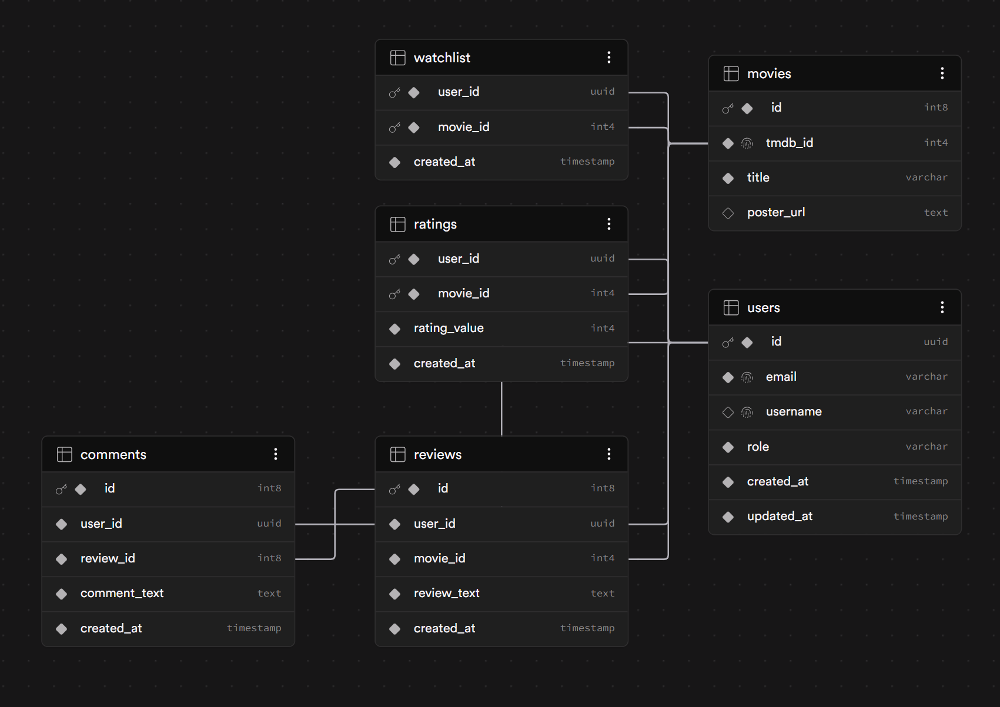

# Database Schema



## Implementation Notes

- Supabase Auth handles login and user identity; the app database stores profile and movie activity data.
- `users.id` matches the Supabase auth user id.
- Movies are identified by TMDb ids, not by a copied full catalog.
- A user can have a watchlist entry, rating, and review tied to a specific movie.
- `watchlist` and `ratings` are one row per user per movie.
- `reviews` stores the review text for a user/movie pair.
- `comments` stores user comments on reviews and links each comment to both a user and a review.

## SQL Statements to Create Tables

```sql
-- Drops for rerunning schema setup if needed
DROP TABLE IF EXISTS comments;
DROP TABLE IF EXISTS reviews;
DROP TABLE IF EXISTS ratings;
DROP TABLE IF EXISTS watchlist;
DROP TABLE IF EXISTS movies;
DROP TABLE IF EXISTS users;

-- Users table to store user information and roles
CREATE TABLE users (
  id UUID PRIMARY KEY,
  email VARCHAR(255) NOT NULL UNIQUE,
  username VARCHAR(100) UNIQUE,
  role VARCHAR(20) NOT NULL DEFAULT 'user',
  created_at TIMESTAMP NOT NULL DEFAULT NOW(),
  updated_at TIMESTAMP NOT NULL DEFAULT NOW()
);

-- Local movie cache / lookup table for TMDb movies
CREATE TABLE movies (
  id BIGSERIAL PRIMARY KEY,
  tmdb_id INT NOT NULL UNIQUE,
  title VARCHAR(255) NOT NULL,
  poster_url TEXT
);

-- Movies a user has saved to their watchlist
CREATE TABLE watchlist (
  user_id UUID NOT NULL REFERENCES users(id) ON DELETE CASCADE,
  movie_id INT NOT NULL REFERENCES movies(tmdb_id) ON DELETE CASCADE,
  created_at TIMESTAMP NOT NULL DEFAULT NOW(),
  PRIMARY KEY (user_id, movie_id)
);

-- One rating per user per movie
CREATE TABLE ratings (
  user_id UUID NOT NULL REFERENCES users(id) ON DELETE CASCADE,
  movie_id INT NOT NULL REFERENCES movies(tmdb_id) ON DELETE CASCADE,
  rating_value INT NOT NULL,
  created_at TIMESTAMP NOT NULL DEFAULT NOW(),
  PRIMARY KEY (user_id, movie_id)
);

-- User reviews for a movie
CREATE TABLE reviews (
  id BIGSERIAL PRIMARY KEY,
  user_id UUID NOT NULL REFERENCES users(id) ON DELETE CASCADE,
  movie_id INT NOT NULL REFERENCES movies(tmdb_id) ON DELETE CASCADE,
  review_text TEXT NOT NULL,
  created_at TIMESTAMP NOT NULL DEFAULT NOW()
);

-- Comments on reviews
CREATE TABLE comments (
  id BIGSERIAL PRIMARY KEY,
  user_id UUID NOT NULL REFERENCES users(id) ON DELETE CASCADE,
  review_id BIGINT NOT NULL REFERENCES reviews(id) ON DELETE CASCADE,
  comment_text TEXT NOT NULL,
  created_at TIMESTAMP NOT NULL DEFAULT NOW()
);

```
